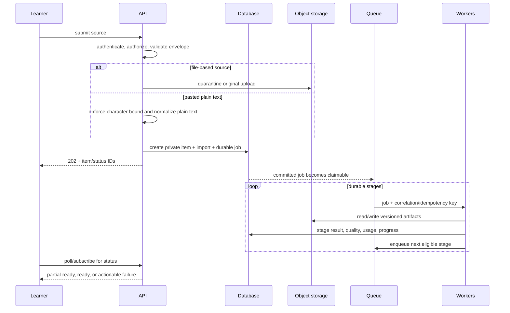

# Data flow

## Import to ready content

File uploads enter a quarantine prefix and are unavailable to parsers or users until server-side type/size checks pass. Pasted text does not enter the file quarantine path: the boundary accepts bounded plain text, discards rich clipboard formatting, preserves paragraph breaks, and stores an immutable private source revision before asynchronous analysis. Extraction/normalization preserves stable source locators. User corrections create a new revision and selectively invalidate derived artifacts.

## Reader and learning state

The API assembles read models from Content, Audio, Reader, Vocabulary, and Learning/progress public contracts. Mutations go to the owning domain. Vocabulary status, reading position, playback state, and review events are user-scoped; shared source artifacts never imply shared user state.

Learning metrics originate from explicit versioned events such as active reading intervals, playback wall time, sentence exposure, vocabulary status changes, and review outcomes. Aggregates can be rebuilt. UI views do not directly increment “success” counters.

## Consistency

- Strong consistency is used inside a domain transaction for invariants and user-visible state transitions.
- Cross-domain updates are eventually consistent through transactionally persisted jobs/events and idempotent consumers. Add an outbox only when direct publication cannot be atomic with state.
- API responses expose pending state when projections lag rather than pretending completion.
- Events include event ID, schema version, subject IDs, occurred-at time, actor, correlation ID, causation ID, and privacy classification.

## Data deletion

Account/content deletion is a tracked workflow: revoke access immediately, cancel eligible jobs, delete user state, decrement artifact references, purge unreferenced objects after a recovery window, and retain only legally required/redacted audit metadata. Exact retention requires a product/operations decision.
