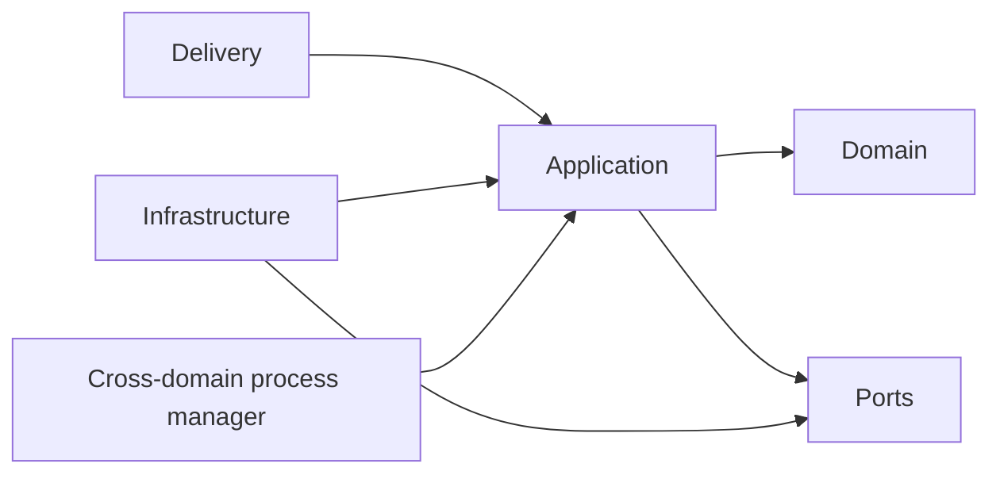

# Domain boundaries

## Modules and ownership

| Module/boundary | Owns | Does not own |
| --- | --- | --- |
| Identity | users, sessions, account lifecycle | learning state or content |
| Learning profile | target language, starting level, preferences | auth credentials |
| Library | user-visible items, metadata overrides, continue/discovery queries | parsing or binary bytes |
| Import | intake request, `SourceAsset` identity/provenance, workflow status and checkpoints | normalized content or derived audio/annotations |
| Content | normalized document hierarchy, stable locators, sentences/tokens | user learning state |
| Audio | permitted audio variants, playback media metadata, segment/word timing | document semantics |
| Language intelligence | lemma, morphology, dependencies, pedagogical mappings | vocabulary status |
| Reader | per-user view, reading/playback position, reader sessions | source transformation |
| Vocabulary | lemma/phrase state, senses, occurrences, reversible status history | review scheduling |
| Review | cards, schedules, attempts, delayed-recall evidence, export intent | marking lesson completion |
| Learning/progress | append-only learning events, aggregates, score policy, goals/streaks, level estimates | inventing source events |
| Platform services (not a product domain) | queue transport, object-storage adapter, provider clients, telemetry plumbing | source/workflow state, artifact business metadata, or product rules |

Analytics is a read model over explicit learning/operational events, not an owner of transactional truth. “AI/NLP” is not a catch-all domain: deterministic language annotations belong to Language intelligence; provider plumbing belongs to platform adapters; user-facing meanings/explanations belong to the consuming product domain. Artifact metadata is owned by the module that gives the artifact business meaning; the object-store adapter only persists bytes.

## Cross-module coordination

The Import **application layer** coordinates the import workflow through public Content, Audio, and Language-intelligence commands/events. It may track stage status and references, but it does not update those modules' tables or adopt their entities. Each producing module validates and owns its output plus artifact metadata.

Library creates the user-owned `LibraryItem` and references the Import-owned source/workflow identity. Reader composes public read contracts from Content and Audio, while its mutations affect only reader state. Vocabulary attaches user state to stable Content occurrences; Review consumes Vocabulary references and emits review outcomes; Learning/progress consumes versioned events without reaching back into source tables. Cross-module calls that must be strongly consistent require an explicit application transaction contract; otherwise use idempotent durable events and expose pending state.

## Allowed dependency direction

Within a domain: `delivery/worker adapters → application → domain`. Infrastructure implements ports declared inward; domain code imports no framework or provider SDK.

Across domains:

- UI/API orchestration may call public application interfaces.
- A domain may consume another domain's versioned event or read contract.
- A domain must not import another domain's entities, repositories, adapters, or database implementation.
- Shared code is restricted to stable primitives (IDs, time/result types, event envelope), not shared business models.
- Cross-domain workflows belong in an application-level process manager (for imports, the Import application layer), not in a domain entity.

A later architecture test must enforce package import rules as soon as packages exist.

## External provider boundaries

Use ports/adapters for object storage, queue/job scheduling, email, error/telemetry export, dictionary/translation, LLM, OCR, speech-to-text, text-to-speech, forced alignment, and embeddings if later justified. Each adapter must define timeouts, retry classification, rate/cost reporting, result validation, and provider/model/config identity.

Do not create interfaces around ordinary arrays, local helpers, internal repositories without an external boundary, or a single pure implementation merely “for flexibility.”

## Extraction criteria

A domain/process may be extracted into a service only when measured evidence shows at least one of:

- materially different scaling or hardware needs that process separation cannot satisfy;
- reliability/blast-radius isolation with an explicit service-level objective;
- independent deployment cadence or ownership;
- legal/data-residency isolation;
- resource contention that cannot be controlled with queues and process limits.

Before extraction, record queue depth, latency, utilization, failure coupling, added network/operations cost, data ownership, and migration plan in an ADR. GPU workers are separate processes from day one but are not independent business services.
