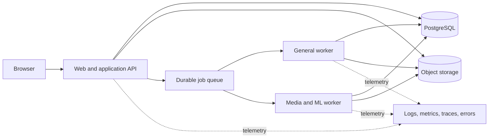

# Architecture overview

## System shape

Readify begins as a modular monolith with separately runnable asynchronous workers. It is one repository, one versioned application, one relational source of truth, and explicit in-process domain boundaries. Web/API and worker processes may scale independently without becoming independently owned services.

HTTP requests authenticate, authorize, validate, persist intent, enqueue work, and return quickly. Workers execute long-running stages and commit durable status. Domain logic depends on ports for genuine external systems; adapters contain provider SDKs and protocols.

## Initial technology baseline

The installed baseline is a pinned TypeScript workspace with a React/Next.js web application and server-side application API, a separate Node worker entry point, and PostgreSQL with a database-backed durable queue. The first slice stores bounded pasted text in PostgreSQL; object storage remains a port and is not installed until a file/media slice requires it. Python exists only as the optional versioned Stanza provider process.

The exact current versions and implementation evidence are recorded in active execution plans. Repository verification executes real format, lint, type, unit, PostgreSQL integration, architecture, migration, and security checks; browser acceptance remains a separate required command/CI job. File imports follow the [PDF reconstruction contract](pdf-import-contract.md).

## Architectural principles

- Domain state and invariants stay independent of web frameworks, queues, object stores, and model SDKs.
- A module exposes application commands/queries/events; its tables and internals are not another module's API.
- Transactional writes and durable job/event publication are atomic when they share PostgreSQL. Use an outbox relay only when the selected transport cannot participate in that transaction.
- Large binaries never live in the relational database; metadata, ownership, checksums, versions, and lifecycle do.
- Derived AI/media artifacts retain provenance: input hash, provider/model/config version, status, and quality signals.
- Degraded optional enrichment must not make already-valid text unusable.

## Deployment units, not microservices

Initially there are only web/API, general-worker, and optional GPU-worker process types. They are built from the same revision and share schemas/contracts. A deployment boundary does not permit direct cross-domain table coupling; [domain rules](domain-boundaries.md) still apply.

See [ADR-0001](../decisions/0001-modular-monolith-and-workers.md) and [ADR-0002](../decisions/0002-technology-baseline.md).

## Current slice contract

The first accepted delivery contract is the [pasted-text Reader architecture/API contract](pasted-text-slice-contracts.md). It applies the system shape above to one bounded vertical slice and owns that slice's HTTP mappings, identifiers, transaction boundaries, consistency, provider ports, and implementation verification requirements without introducing another deployment unit.

In the diagram, object storage and media/ML scaling paths are future extraction points, not current first-slice services. The executable slice deploys web/API, the general worker, PostgreSQL, and the optional local Stanza provider process only.
