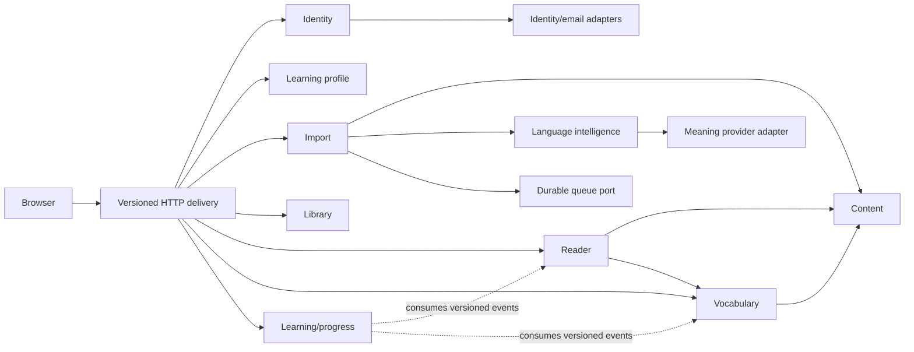

# Pasted-text slice architecture and API contracts

- Status: Accepted for implementation planning
- Date: 2026-09-01
- Product contract: [Pasted-text Reader learning loop](../product-specs/pasted-text-reader-learning-loop.md)
- API convention: [ADR-0005](../decisions/0005-versioned-json-http-contracts.md)

This document owns the first slice's application and browser/API contracts. It does not prescribe tables, ORM models, packages, component structure, or external providers. Broader domain and job rules remain owned by the linked architecture documents.

## Slice guardrails

- One authenticated account has one French learning profile in this slice.
- The original slice contains bounded pasted plain text. PDF and EPUB upload are additive file-source paths with bounded extraction and ordered sections; audiobook attachment remains outside this contract.
- Pasted text is capped at 50,000 Unicode scalar values; extracted PDF/EPUB text is capped at 1,000,000 Unicode scalar values. Uploaded bytes remain capped at 200 MB.
- A pasted submission creates one document revision with one logical section; paragraph breaks do not create sections.
- Text processing and language analysis are durable jobs. No request waits for them.
- Valid prepared text remains readable when language analysis or meaning lookup fails.
- Vocabulary state is explicit, lemma-scoped, reversible self-report. It never creates recall evidence.
- Reader position and section completion are independent; neither opening nor scrolling records learning success.
- Identity, email delivery, meaning data, queue, storage, and telemetry remain provider boundaries. No provider type appears in a domain or public API contract.

## Slice composition and ownership



The delivery layer may compose public queries but owns no business state. Import is the process manager for intake and processing. A module never reads another module's tables; the modular monolith may share one database transaction only through explicit application operations and a unit-of-work boundary.

## Shared HTTP conventions

- Browser JSON routes are same-origin under `/api/v1`. Framework routes are adapters over application commands/queries.
- Requests and responses use UTF-8 JSON. Timestamps are UTC RFC 3339 strings. Enumerations are lowercase `snake_case` wire values.
- IDs are opaque strings. Clients do not infer type, ownership, order, or storage location from them.
- Absent optional fields are omitted unless `null` carries product meaning. Unknown response fields must be ignored for additive compatibility.
- State-changing requests use the authenticated session and the selected transport's CSRF protection. Account/user IDs are derived from the session, never accepted from request bodies.
- `X-Request-Id` is generated at ingress and returned on every response. W3C trace context may propagate separately. Only validated bounded correlation values may be accepted from a trusted internal caller.
- List queries use opaque cursors, a default limit of 20, and a maximum of 50. The slice adds no search/filter parameters.
- API responses contain stable codes and neutral safe text. Turkish UI copy is owned by the client and keyed from the stable code.

### Idempotency

`Idempotency-Key` is required for commands that can create duplicate work or history:

- create pasted-text import;
- retry a processing capability;
- change vocabulary state;
- undo a vocabulary state change.

The key is scoped to account, operation, and route. Once a command commits, replaying the same key and canonical request returns the original result without repeating side effects. Reusing it with a different canonical request returns `409 idempotency_key_reused`. Validation responses that commit no state do not consume the key; after a user-visible correction, the client creates a new key. Committed keys and their canonical request/result identity are retained for at least 24 hours, which is the supported client retry window; same-content import deduplication remains independent and longer lived.

Reader position and section completion use idempotent `PUT` semantics and do not require this header. Clients serialize position saves; the last committed valid position wins across devices.

### Error contract

Errors use `application/problem+json`:

```json
{
  "type": "urn:readify:problem:text_too_long",
  "title": "Submitted text is too long",
  "status": 422,
  "code": "text_too_long",
  "referenceId": "opaque-safe-reference",
  "fieldErrors": [
    { "field": "text", "code": "max_scalar_values", "limit": 50000 }
  ]
}
```

`referenceId` correlates safe operational evidence and exposes no stack/provider/parser detail. `fieldErrors` and optional metadata are allowlisted per error code; they never echo pasted text, vocabulary context, email-link tokens, provider payloads, or another account's identifiers.

| Status | Meaning in this slice                                                                |
| ------ | ------------------------------------------------------------------------------------ |
| `400`  | malformed JSON, cursor, header, or route input                                       |
| `401`  | no valid session                                                                     |
| `404`  | resource absent or not owned by the session account                                  |
| `409`  | stale/current-state conflict, stale revision, or idempotency-key misuse              |
| `422`  | well-formed request violates text/language/domain validation                         |
| `429`  | bounded rate/quota response with safe retry guidance                                 |
| `503`  | transient dependency/capability unavailable; prior valid state remains authoritative |

Owned-resource authorization failures use `404`, not `403`, so guessed IDs do not reveal existence. A same-account duplicate is a successful import outcome, not an authorization error.

## Identifiers and semantic locators

The public contracts use distinct opaque identities:

- `libraryItemId`, `importId`, `sourceRevisionId`;
- `sectionId`, `paragraphId`, `sentenceId`, `occurrenceId`, `lemmaId`;
- `vocabularyItemId`, `stateChangeId`.

Content identities are immutable within a `sourceRevisionId`. Reprocessing that changes normalized content creates a new revision and new structural identities; it never silently reassigns an old ID.

`lemmaId` is different: it identifies a canonical lemma within a learning language and lemma-normalization policy, not within one source revision. Matching analyses across Library items reuse that identity so account + language + lemma vocabulary state remains coherent. A later analyzer/policy change that would merge or split lemma identity requires an explicit mapping/migration; it never silently repoints saved state.

A semantic source locator is:

```json
{
  "sourceRevisionId": "rev_opaque",
  "sectionId": "sec_opaque",
  "paragraphId": "par_opaque",
  "sentenceId": "sen_opaque",
  "occurrenceId": "occ_opaque"
}
```

Only `sourceRevisionId`, `sectionId`, and `paragraphId` are always required. More precise IDs are added when available. Navigation resolves an exact locator when its revision is current; otherwise it returns the nearest authorized locator with `resolution: "nearest"` and `reason: "source_revision_changed"`. The first slice has no editing UI, but this rule prevents pixel-based resume and preserves the future revision boundary.

## Pasted-text normalization and intake

The server is authoritative even when the browser performs the same checks for responsiveness:

1. cap the complete HTTP JSON body at 512 KiB before parsing, require a JSON string, and reject ill-formed Unicode such as unpaired surrogates;
2. normalize `CRLF` and lone `CR` to `LF`;
3. remove complete whitespace-only lines before the first content line and after the last content line, without trimming characters from content lines;
4. preserve all internal characters, spaces, newlines, and paragraph order;
5. count Unicode scalar values on the normalized value, including internal LF and combining marks;
6. reject empty/whitespace-only or more than the configured slice maximum;
7. treat HTML/Markdown/template-looking sequences as literal text and escape them on render;
8. generate the title from the first non-empty line by collapsing display whitespace and truncating to 80 Unicode scalar values, with `İsimsiz metin` only if no safe visible title remains;
9. compute an account-scoped, non-public cryptographic content digest over the normalized value plus normalization version.

The pre-normalized request body is not retained. Normalization v1 is exactly steps 2–4 above and does not apply NFC/NFKC, case folding, punctuation substitution, or internal trimming. The normalized private input and normalization version form the immutable Import-owned source input; the first slice may store this bounded text transactionally in PostgreSQL and does not require object storage. Hashes are never exposed through the API or telemetry. Browser and server must share conformance vectors rather than relying on JavaScript UTF-16 `.length`.

Language mismatch detection runs before state is committed. A policy-qualified non-French result always returns `422 language_mismatch`; there is no client override. Undetermined detection does not invent a mismatch. The error may return an allowlisted detected language code but no raw model output. The legacy `source_revisions.language_mismatch_accepted` column remains default-false for migration compatibility and is not writable through the application contract.

The expected language comes from the authenticated learning profile and is not trusted from the request body. Import without the required profile returns `409 learning_profile_required`.

## Processing contract

### Durable workflow

```text
accepted
→ queued
→ preparing_text
→ text_ready
→ analyzing_language
→ ready
```

Failure after `text_ready` produces readable degraded content; failure before valid text exists produces a failed item.

The public status separates workflow presentation from capabilities:

```json
{
  "overall": "processing",
  "stage": "analyzing_language",
  "capabilities": {
    "text": "ready",
    "wordTools": "pending"
  },
  "progress": null,
  "retryableCapabilities": [],
  "error": null,
  "version": 4,
  "updatedAt": "2026-09-01T12:00:00Z"
}
```

Allowed public values:

- `overall`: `processing`, `ready`, `ready_degraded`, `failed`;
- `stage`: `queued`, `preparing_text`, `analyzing_language`, `complete`;
- capability: `pending`, `ready`, `failed`.

`ready_degraded` requires `text=ready` and `wordTools=failed`. `failed` means no readable text capability. `progress` is omitted/null when no reliable total exists; when present it contains integer `completed`, `total`, and an allowlisted unit, never a guessed percentage. Error data is a stable safe code plus reference ID. Retry lists only capabilities with a classified retryable failure.

Pasted text creates exactly one section. Text preparation preserves the normalized paragraphs, segments sentences, and assigns stable occurrence/lemma references. Language analysis may be retried without rerunning accepted intake or valid text preparation.

### Transaction boundaries

1. **Accept import:** after bounded validation/language acknowledgment, one database transaction performs same-account duplicate arbitration, stores the Import-owned normalized source input/digest, creates Import workflow and Library item through public application operations, inserts the first durable job, and commits. Rollback leaves none of these visible.
2. **Complete a stage:** one worker transaction records the attempt/result and capability status, stores the producing domain's versioned output, and inserts the next eligible database-backed job. Redelivery compares idempotency/version before committing.
3. **Vocabulary change/undo:** one Vocabulary transaction records the current lemma state, occurrence association, reversible history, and a versioned learning event. The response reflects the committed state.
4. **Reader position:** one Reader transaction authorizes the current revision/locator and replaces the account-item position. No learning event is emitted.
5. **Section completion:** one Reader transaction records explicit completion and its versioned learning event. It never mutates Vocabulary.
6. **Progress:** Learning/progress consumes Vocabulary/Reader events idempotently in separate transactions. Its summary is eventually consistent and reports its computation time.

With the accepted PostgreSQL queue, job/event insertion participates directly in the state transaction under [ADR-0004](../decisions/0004-atomic-durable-handoff.md). A future external queue requires an outbox before cutover, not a change to these application contracts.

## Browser/API surface

This table maps HTTP delivery to owned application contracts. Exact framework handlers are intentionally unspecified.

| HTTP contract                                                                  | Application owner      | Result                                                                                |
| ------------------------------------------------------------------------------ | ---------------------- | ------------------------------------------------------------------------------------- |
| `POST /api/v1/auth/email-link-requests`                                        | Identity               | uniform `202`; request accepted without account disclosure                            |
| `POST /api/v1/auth/email-link-sessions`                                        | Identity               | consume provider-neutral one-time proof, establish session, return safe intended path |
| `GET /api/v1/session`                                                          | Identity               | current authenticated session or `401`                                                |
| `DELETE /api/v1/session`                                                       | Identity               | revoke current session; `204`                                                         |
| `GET /api/v1/me/learning-profile`                                              | Learning profile       | profile or `404 profile_not_created`                                                  |
| `PUT /api/v1/me/learning-profile`                                              | Learning profile       | idempotently create the slice profile                                                 |
| `POST /api/v1/imports/pasted-text`                                             | Import process manager | `202 created`, `200 duplicate`, or validation problem                                 |
| `POST /api/v1/imports/file`                                                    | Import process manager | `202 created`, `200 duplicate`, or safe file validation/extraction problem            |
| `GET /api/v1/library-items`                                                    | Library composition    | bounded owned items with processing and resume summaries                              |
| `GET /api/v1/library-items/{libraryItemId}`                                    | Library composition    | owned item/status/capabilities                                                        |
| `GET /api/v1/library-items/{libraryItemId}/book-index`                         | Library composition    | owned book summary and ordered chapter/section list                                   |
| `POST /api/v1/library-items/{libraryItemId}/processing-retries`                | Import                 | accepted retry for one advertised capability                                          |
| `GET /api/v1/library-items/{libraryItemId}/reader?sectionId=...&cursor=...`    | Reader composition     | cursor-paged selected section, confirmed states, and semantic saved position           |
| `PUT /api/v1/library-items/{libraryItemId}/reader-position`                    | Reader                 | authoritative confirmed semantic position                                             |
| `PUT /api/v1/library-items/{libraryItemId}/sections/{sectionId}/completion`    | Reader                 | authoritative explicit completion                                                     |
| `GET /api/v1/library-items/{libraryItemId}/occurrences/{occurrenceId}/context` | Reader composition     | deterministic token/state/context plus independently degradable meaning               |
| `GET /api/v1/vocabulary-items`                                                 | Vocabulary             | bounded explicit lemma-state items                                                    |
| `POST /api/v1/vocabulary-state-changes`                                        | Vocabulary             | committed state and reversible change identity                                        |
| `POST /api/v1/vocabulary-state-changes/{stateChangeId}/undo`                   | Vocabulary             | restored prior state or stale-change conflict                                         |
| `GET /api/v1/progress/summary`                                                 | Learning/progress      | structural/self-report summary and projection freshness                               |

### Authentication and profile payloads

Email-link request accepts normalized email plus an allowlisted relative `returnPath`; it always returns the same safe `202` shape whether an account already exists. One-time proofs and provider callback parameters are secret, single-use, time-bounded, redacted from logs, and mapped by the Identity adapter before the application session is established. No contract commits to a provider callback URL or SDK type.

The slice profile is:

```json
{
  "targetLanguage": "fr",
  "startingLevel": "B1"
}
```

Allowed levels are `A1`, `A2`, `B1`, `B2`, `C1`, `C2`. Another target language is `422 unsupported_target_language`. Repeating the same `PUT` is a no-op success; a different payload after profile creation returns `409 profile_already_created`. Profile editing is not added by this slice.

### Create pasted-text import

Request:

```json
{
  "text": "Le texte français…"
}
```

Created response (`202`):

```json
{
  "outcome": "created",
  "libraryItem": {
    "id": "lib_opaque",
    "title": "Le texte français…",
    "sourceType": "pasted_text",
    "readerAvailable": false,
    "processing": {
      "overall": "processing",
      "stage": "queued",
      "capabilities": { "text": "pending", "wordTools": "pending" },
      "progress": null,
      "retryableCapabilities": [],
      "error": null,
      "version": 1,
      "updatedAt": "2026-09-01T12:00:00Z"
    }
  }
}
```

A new idempotency key with the same normalized account-scoped content returns `200` with `outcome: "duplicate"` and the existing owned Library item summary. It creates no source, item, event, or job. A language mismatch returns `422 language_mismatch` with allowlisted `detectedLanguage`; no partial state exists.

### Library and status

Library queries compose Library ownership/metadata, Import processing state, and Reader position through public read contracts. They do not copy another module's tables into a new general-purpose model. The first slice may query-compose synchronously; introduce a materialized projection only after measured query need.

Each item exposes generated title, `sourceType`, `readerAvailable`, processing contract, and either no position or a structural summary. The response never includes raw pasted text. Polling with bounded backoff is sufficient for the first slice; push/WebSocket infrastructure is not required. `processing.version` lets the client ignore stale poll responses.

Retry request:

```json
{ "capability": "word_tools" }
```

Only a capability advertised in `retryableCapabilities` is accepted. Retry creates a new audited attempt, reuses valid text preparation, and returns `202` with the new processing version. Concurrent/replayed retry commands create at most one attempt per idempotency key.

### Reader content and position

Reader query accepts optional `sectionId`, opaque window `cursor`, bounded `limit`, and optional semantic locator for a source link. It returns:

- Library title and current immutable `sourceRevisionId`;
- the single section identity/ordinal/completion state;
- a bounded ordered paragraph window and next cursor;
- each paragraph's exact normalized text;
- sentence boundaries and token occurrences as scalar-value offsets into that paragraph;
- token `occurrenceId`, `lemmaId` when analysis is ready, and confirmed vocabulary state;
- confirmed saved position plus exact/nearest resolution metadata;
- processing capabilities so unavailable word tools degrade explicitly.

Offsets are zero-based Unicode scalar-value half-open ranges `[start, end)` and are valid only within their named revision/paragraph. Tests must cover apostrophes/elision, combining marks, and non-BMP characters so browser/server slicing agrees. Clients render paragraph text as text, never HTML.

Position request:

```json
{
  "sourceRevisionId": "rev_opaque",
  "anchor": {
    "sectionId": "sec_opaque",
    "paragraphId": "par_opaque",
    "sentenceId": "sen_opaque"
  }
}
```

The API confirms the resolved locator and a monotonic position `version`. A stale revision returns `409 stale_source_revision` with an allowlisted nearest locator. Clients keep at most one position save in flight and do not show synchronized state before success. Completing the one section uses `{ "completed": true }`; repeating it is a no-op and it emits no duplicate completion event.

### Contextual word lookup and meaning boundary

Context query authorizes the Library item and verifies the occurrence belongs to its current revision. It returns deterministic content and vocabulary state even when meaning is unavailable:

```json
{
  "occurrence": {
    "id": "occ_opaque",
    "surface": "mange",
    "lemmaId": "lem_opaque",
    "lemma": "manger"
  },
  "sourceSentence": "Il mange une pomme.",
  "vocabulary": { "itemId": null, "state": null, "version": 0 },
  "meaning": {
    "status": "available",
    "text": "yemek",
    "provenance": {
      "source": "provider-neutral-name",
      "sourceVersion": "dataset-version",
      "entryId": "provider-entry",
      "attribution": "display-safe attribution"
    }
  }
}
```

The meaning application port receives source/target language, surface, lemma, optional POS, and the containing sentence—not the document. It returns bounded meaning text and display/license provenance. An unavailable result includes a classified reason and explicit retryability. The first implementation uses the repository fixture catalog in local/test/restricted synthetic preview and returns non-retryable `not_in_fixture` outside that catalog; it makes no external request and cannot be enabled in production. There is no hidden AI/secondary fallback. A future production adapter must minimize what leaves the process: sending a private sentence or account/document identifier is forbidden until the provider's data-processing, retention, training, and license terms are explicitly approved; otherwise the request is limited to non-contextual lemma/POS data or selection runs locally. Caching/storage follows the later approved license rather than an assumed right. Every adapter has a hard deadline where applicable, classified errors, response validation, provider/dataset/selector-version telemetry, and the same deterministic contract fake. A timeout/unavailable result remains a successful context response with `meaning.status: "unavailable"`, safe reference ID, and retryability; vocabulary actions remain usable. Retry appears only when the result is classified retryable and reissues this context query without rerunning language analysis or vocabulary state.

### Vocabulary state and Undo

State-change request:

```json
{
  "libraryItemId": "lib_opaque",
  "occurrenceId": "occ_opaque",
  "state": "recognized"
}
```

Allowed states are `new`, `recognized`, `familiar`, `learned`, `known`, and `ignored`; null means lookup-only/unclassified and is never submitted. The first four are explicit self-reported learning stages, and `learned` is not demonstrated recall. `known` remains a separate explicit self-report. The server resolves and authorizes the occurrence and lemma; clients cannot supply arbitrary lemma text or owner IDs. State is unique by account + learning language + lemma and projects to all current occurrences. Existing pre-migration `learning` values upgrade to `new`; downgrade collapses the four stages back to `learning` and therefore loses stage specificity.

The committed response includes `stateChangeId`, `vocabularyItemId`, `lemmaId`, confirmed state, state `version`, source occurrence, and whether the action created or updated the item. Meaning availability is not a precondition. Repeating the idempotency key records at most one change.

Undo targets `stateChangeId` and restores its recorded prior state only when that change is still the item's current head. If a later change exists, return `409 stale_state_change`; never overwrite it. A successful Undo is itself an auditable idempotent history entry and returns the new confirmed version. Reader/Vocabulary clients update visible occurrences by returned `lemmaId` and then reconcile through normal queries.

Vocabulary list returns only explicitly classified items with lemma/surface, meaning when available, state/version, first source sentence, occurrence count, and authorized source locator. No search/filter/due/card/export fields are added for this slice.

### Minimal Progress

Progress returns:

```json
{
  "content": {
    "completedSections": 1,
    "totalSections": 1
  },
  "learningState": {
    "learningLemmas": 2,
    "selfMarkedKnownLemmas": 1,
    "ignoredLemmas": 0
  },
  "demonstratedRecall": {
    "available": false,
    "reason": "no_review_data"
  },
  "freshness": {
    "computedAt": "2026-09-01T12:00:00Z",
    "updating": false
  }
}
```

Counts derive only from explicit section-completion and vocabulary-state events. The Progress `learning` count aggregates `new`, `recognized`, `familiar`, and `learned`; it does not imply recall. The projection may lag a just-confirmed write; `freshness.updating` is true when known committed events remain unapplied. The UI retains the last confirmed values and labels refresh rather than inventing immediate mastery. No reading time, exposure, recall score, streak, heatmap, or CEFR field exists in this response.

## Internal events and job payloads

First-slice versioned messages are intentionally small and contain identities/counts, not source text:

- `PastedTextImportAccepted.v1`;
- `TextPreparationRequested.v1`, `TextPrepared.v1`, `TextPreparationFailed.v1`;
- `LanguageAnalysisRequested.v1`, `LanguageAnalysisCompleted.v1`, `LanguageAnalysisFailed.v1`;
- `VocabularyStateChanged.v1`, `VocabularyStateChangeUndone.v1`;
- `ReaderSectionCompleted.v1`.

Every message uses the standard event/job envelope from [background jobs](background-jobs.md). Job payloads reference the authorized private source revision; they do not copy pasted text into the queue. Producing model/parser/policy versions are stored with results. Events are additive contracts; a breaking payload change creates a new version and dual-compatible migration plan.

## Authorization and privacy matrix

| Capability                                 | Required scope/check                                                 |
| ------------------------------------------ | -------------------------------------------------------------------- |
| Profile                                    | current session account only                                         |
| Import/duplicate                           | current account; duplicate lookup account-scoped                     |
| Library/status/retry                       | item ownership before status/error details                           |
| Reader/content/context/position/completion | item ownership plus locator belongs to current revision              |
| Vocabulary mutation/undo/source link       | item/occurrence/change belongs to current account and French profile |
| Progress                                   | current account + French profile only                                |

Authorization runs in every application command/query, not only route middleware. Raw pasted text, normalized text, source sentences, meanings, emails, one-time proofs, session tokens, and provider request/response bodies are prohibited in logs, traces, metrics, error reports, and job/event envelopes. Metrics use bounded source type, stage, outcome, provider/version, and error classification—not account, lemma, or document labels.

## Observability contract

Every request and job carries request/trace/correlation plus relevant opaque domain IDs. Required first-slice signals:

- import acceptance/duplicate/validation outcome and duration without content;
- workflow stage duration, retry, lease recovery, failure class, and time to `text_ready`/`ready`;
- queue depth/oldest age and worker heartbeat by job type;
- Reader/context request latency and error class;
- meaning provider latency, timeout/error, cache result, dataset/policy version, and bounded usage/cost where applicable;
- vocabulary change/undo outcome and conflict count without lemma/context;
- reader-position save failure and stale-revision count;
- Progress projection lag/age;
- authorization denial counts without resource existence leakage.

A safe `referenceId` must lead from a user-visible failure to request, workflow, stage attempt, deployment revision, and classified provider outcome in centralized tooling. Replay remains privileged, scoped, audited, and unavailable until its runbook exists.

## Mechanical verification required during implementation

The future executable slice must add:

- schema/contract tests for every route and problem code;
- domain tests for normalization, character counting, title, duplicate arbitration, states, Undo head checks, completion, and no-silent-learning invariants;
- real-PostgreSQL tests proving accept-import/job commit and rollback atomicity, unique duplicate arbitration, worker redelivery, and progress projection idempotency;
- API authorization tests proving cross-account IDs return indistinguishable `404` responses;
- provider-adapter contract tests with deterministic identity/email and meaning fakes;
- browser acceptance for the 23 product scenarios, the accepted [accessibility verification baseline](../quality/accessibility.md), responsive structure, keyboard flow, escaped markup, and semantic resume;
- architecture checks preventing domain/provider SDK leakage and forbidden cross-domain internals;
- migration clean-apply/upgrade/drift checks when the first schema appears;
- telemetry redaction tests for pasted text, context, email proofs, and provider payloads.

Do not install an OpenAPI generator, workflow engine, event broker, or contract framework in this documentation phase. The implementation plan should materialize these accepted shapes in the smallest repository-native typed schema and generate OpenAPI only if it becomes the single checked source rather than duplicated documentation.

## Acceptance traceability

| Product scenarios | Owning contract evidence                                                                                                                     |
| ----------------- | -------------------------------------------------------------------------------------------------------------------------------------------- |
| 1                 | authentication endpoints, uniform response, one-time-proof rules                                                                             |
| 2                 | create-only French profile contract                                                                                                          |
| 3–6               | normalization/intake, validation, language acknowledgment, idempotency, account-scoped duplicate outcome                                     |
| 7–9               | durable workflow, capability status, stage transactions, targeted retry                                                                      |
| 10                | normalization/version/title rules, one-section content contract, scalar-value locators                                                       |
| 11                | Reader/section transaction rules; no position/completion vocabulary or recall side effect                                                    |
| 12–13             | contextual lookup and independently degradable meaning port                                                                                  |
| 14–18             | lemma-scoped state, authoritative response, idempotency, head-safe Undo                                                                      |
| 19                | semantic locator and Reader-position conflict/resolution contract                                                                            |
| 20                | minimal event-derived Progress shape and freshness                                                                                           |
| 21–22             | responsive/keyboard behavior remains UX-owned; bounded Reader/context/import contracts provide the required states and focus-safe identities |
| 23                | authorization/privacy matrix and non-enumerating `404` rule                                                                                  |

## Implementation decisions and deferred rollout gates

- Identity implements the provider-neutral contract with deterministic local/test delivery. No managed provider SDK enters the first implementation; non-production delivery must fail closed in production.
- Meanings implement the provider-neutral port with the approved fixture catalog and `unavailable` fallback. No external dictionary enters the first implementation; the fixture adapter must fail closed in production.
- The 50,000-scalar normalization/counting policy is an implementation/acceptance limit rather than a final production quota. The 512 KiB body ceiling and 24-hour idempotency window are technical slice bounds.
- The [accessibility verification baseline](../quality/accessibility.md) is required for slice acceptance; the public browser/OS/AT support matrix is deferred.
- Managed identity/email, licensed production meanings, a measured production quota, and the public support promise are production rollout gates tracked in [first-slice implementation readiness](../product/first-slice-implementation-readiness.md), not implementation blockers.
- Runtime and dependencies are exact-pinned in the lockfile. [ADR-0006](../decisions/0006-kysely-and-sql-first-migrations.md) selects Kysely with reviewed migrations; repository-owned Zod schemas validate HTTP command payloads and no duplicated OpenAPI artifact is generated.
- Language mismatch uses pinned offline `franc-min` with an 80-scalar minimum. French is accepted; only an English classification plus at least three allowlisted English function-word signals becomes a mismatch. Short, `und`, other-language, or weak results remain `undetermined` to avoid false rejection.
- Normal local/test analysis uses repository-owned recorded French results. The optional Stanza process pins Python 3.12.12, Stanza/resources 1.14.0, model processors, and its container base digest; it is not downloaded or started by normal CI.
- Materialized Library projection, push status, external queue/outbox, or object storage for pasted text remain deferred until evidence requires them. Numeric production latency/SLO/rate/quota promises remain rollout decisions; current body/idempotency and bounded local rate controls are slice safety limits, not public capacity claims.

These remaining deferrals do not change the application contracts above. Selecting a production provider or making a material contract change requires updating this document and, when costly to reverse, a new ADR before rollout.
