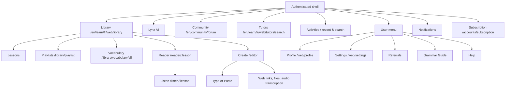

# Bilgi Mimarisi ve Genel Navigasyon

**İnceleme tarihi:** 26 Ağustos 2026  
**Kapsam:** Giriş yapılmış Fransızca çalışma alanı; route'lar T3 Browser'da görülen örneklerdir.

## Gözlenen yapı

## Bölümlerin amacı ve geçişleri

| Bölüm | Giriş | Amaç | Geri dönüş / bağlantı |
| --- | --- | --- | --- |
| Library | Sol menü `Library` | İçerik keşfi, ders/playlist/vocabulary sekmeleri | Ders kartı reader'a; üst sekmeler aynı bağlamda |
| Reader | Ders kartı | Okuma, kelime etkileşimi, lesson metadata | Library'ye geri; More menüsünden listen, statistics, grammar |
| Listen | Reader player veya audio ikonu | Transcript eşliğinde ses dinleme | Reader'a geri; cümle tıklaması seek ediyor |
| Vocabulary | Library > Vocabulary | Saved words/phrases, filtre, review | Review alt route'u; reader'a source linkleri |
| Create | Sol menü `Create` | Kullanıcı içeriğini lesson'a dönüştürme | Üç adımlı editor; gönderim öncesi Review & Import |
| Activities | Sol menü `Activities` | Son aktiviteler ve arama | Progress menüsü değil; Profile metriklerine dolaylı geçiş |
| Profile | Kullanıcı menüsü | Dil bazlı istatistik, hedef ve streak | Settings ve Library'ye geri |
| Settings | Kullanıcı menüsü | Tier/limit, hesap ve silme uyarısı | Subscription'a `Change plan` ile bağlanır |
| Community | Sol menü | Forum, challenge, ranking ve writing exchange | Global community route; lesson akışından ayrılır |
| Tutors | Sol menü | Tutor keşfi, fiyat ve booking CTA | Buy Points; booking'e geçmeden duruldu |

## IA değerlendirmesi

**Doğrudan gözlendi:** Library ana çalışma merkezi; Lessons/Playlists/Vocabulary aynı sekme ailesinde. Reader içinden More menüsü, audio player ve vocabulary paneli farklı öğrenme eylemlerini bağlayabiliyor. Sol menü dar viewport'ta ikonlaşarak alan kazanıyor.

**Çıkarım (yüksek güven):** Ürün içerik-merkezli ve “ders” nesnesini ana navigasyon omurgası yapıyor; Profile/Settings ise kullanıcı menüsünde ikincil. Bu, öğrenme döngüsünü hızlı başlatıyor fakat Progress'in ayrı ve görünür bir birinci sınıf hedef olarak algılanmasını zorlaştırıyor.

**Sürtünme:** `Activities` adı ilerleme/statistik çağrışımı yapıyor, ancak görülen içerik recent/search. Profile istatistiklerine ulaşmak için kullanıcı menüsünü bilmek gerekiyor. Top-level `Upgrade` banner'ı da öğrenme içeriği ile ticari akışı aynı görsel seviyeye taşıyor.

## Bizim ürünümüz için sonuç

Çekirdek döngü için tek bir “Continue” yüzeyi, Library içinde açık “For your level” filtresi ve Profile/Progress'i ana navigasyonda görünür bir hedef yapmak daha anlaşılır olur. İçerik, sözlük ve review aynı lesson bağlamında kalmalı; topluluk/tutor alanları çekirdek akışı bölmeyecek ikincil katman olmalı.

**Kanıt:** [LQ-AUTH-001], [LQ-LISTEN-001], [LQ-VOC-002], [LQ-SET-001].
