# Core Learning Loop: Kontrollü Fransızca Deneyi

**İnceleme tarihi:** 26 Ağustos 2026  
**Ders:** `1a - Michel est cuisinier, partie 1`, Mini Stories France, Reader route `/en/learn/fr/web/reader/23800720`.

## Gerçek kullanıcı akışı

```mermaid
flowchart LR
 A[Library'de Mini Story seç] --> B[Reader: oku]
 B --> C[Mavi bilinmeyen kelimeye tıkla]
 C --> D[Anlam/dictionary/context paneli]
 D --> E[Status 1 LingQ veya Known]
 E --> F[Audio: cümle senkron dinle]
 F --> G[Sentence View / review]
 G --> H[Completion ekranı]
 H --> I[Profile: metrikleri kontrol et]
 I --> J[Uygun yeni input'a devam et]
```

## Gözlenen adımlar ve durum değişimleri

1. Library'de Mini Stories ve Beginner/Intermediate filtrelerinden kısa ders açıldı. Ders kartı 79 total/53 unique words ve yüksek new-word sinyali taşıyordu.
2. Reader'da kelimeler mavi unknown olarak gösterildi. `histoire`, `déjeune`, `voiture` ve `en voiture` ile toplam dört vocabulary öğesi oluşturuldu; `voiture` status 4/Known'a alındı.
3. Audio player açıldı; ayrı Listen route'unda aktif cümle vurgulandı ve cümleye tıklayarak seek yapıldı.
4. Sentence View'da token navigasyonu ve Review Sentence akışı (anlam kartı → sentence ordering → speaking adımı) denendi. Speaking mikrofonu açılmadan atlandı.
5. Reader completion kontrolü açıldığında kalan 50 mavi kelime, toplu onay düğmesine basılmadan ara ekranda Known'a çevrildi; Back bunu geri almadı. Bu bir ürün davranışı ve güvenlikli deneyde hesabı değiştiren ana olaydır.
6. Profile'da 51 Known Words, 1 Completed Lesson, 4 LingQs Created, 1 Learned LingQ, 0.02 listening hour, 406 read words, 904 coin ve 1-day streak görüldü.

## Değer ve kopukluklar

**Güçlü:** Aynı kelime etkileşimi reader, vocabulary listesi, review ve progress'e bağlanıyor. Ses, metni terk ettirmeden cümle bağlamına taşıyor.

**Sürtünme:** “Complete” eylemi kullanıcıya son onay vermeden bulk Known etkisi yarattı. Reader açılışı ve tekrarları `Words Reading` sayacını hızla büyütebiliyor; metrik öğrenmeyi olduğundan iyi gösterebilir. Sentence Translation premium modalı doğal akışta kırılma yaratıyor.

**Çıkarım (yüksek güven):** LingQ'nun temel tezi “anlaşılabilir gerçek input + tekrar + kişisel vocabulary” olarak gerçekten ürün davranışına yansıyor. **Çıkarım (orta güven):** Coin/streak, completion ve goal aynı döngüyü sürdürmek için retention katmanı oluşturuyor.

## Bizim ürünümüz için sonuç

MVP'de bu yedi adımlı döngü tek bir ders içinde uçtan uca ölçülmeli. Completion, otomatik toplu öğrenme yerine açık önizleme ve kullanıcı onayı istemeli; read/listen/known metrikleri ayrı tutulmalı.

**Kanıt:** [LQ-AUTH-001], [LQ-READ-001], [LQ-LISTEN-001], [LQ-SENT-001], [LQ-COMP-001], [LQ-PROG-002].
