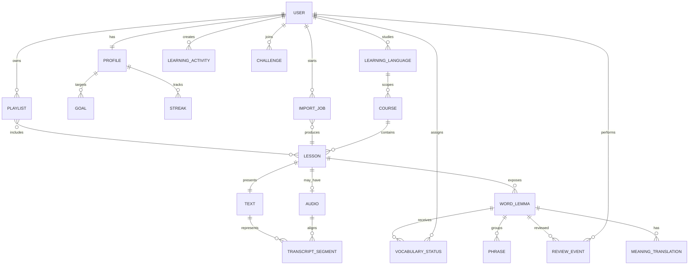

# Kavramsal Ürün Modeli

**İnceleme tarihi:** 26 Ağustos 2026

Aşağıdaki model yalnızca arayüzde gözlenen nesne ve ilişkilerden türetilmiştir; LingQ'nun doğrulanmış backend şeması değildir.

## Gözlenen anlamlar

- `Lesson`, text, audio, course, source snippet, read/listen state ve completion etrafında merkez nesne.
- `Word/lemma`, `Phrase`, meaning ve status reader ile Vocabulary ekranını bağlıyor.
- `Review event` ve `Learning activity`, Profile metriklerinin gözlenen davranışsal karşılığı; gerçek event şeması görülmedi.
- `Import job`, editor'daki üç adımlı akış ve transcription beklentisini temsil eden kavramsal nesne.
- `Goal`, `Streak`, `Challenge`, `Playlist` arayüzde ayrı motivasyon/organizasyon katmanları olarak görünüyor.

## Belirsizlikler

Lemma–çekim birleştirme, timestamp granülerliği, status tarihçesi, SRS scheduler ve import job hata durumları doğrulanmadı. `Profile` metriklerinin hangi eventlerden hesaplandığı yalnız kontrollü deneyle kısmen çıkarılabilir.

## Bizim ürünümüz için sonuç

MVP veri modeli `LearningLanguage → Lesson(Text+Audio+TranscriptSegment) → Word/Phrase → VocabularyStatus → ReviewEvent → LearningActivity` zincirini yalın tutmalı. Goal/Streak/Playlist sonradan eklenebilir; her metriğin kaynak event'i denetlenebilir olmalı.
