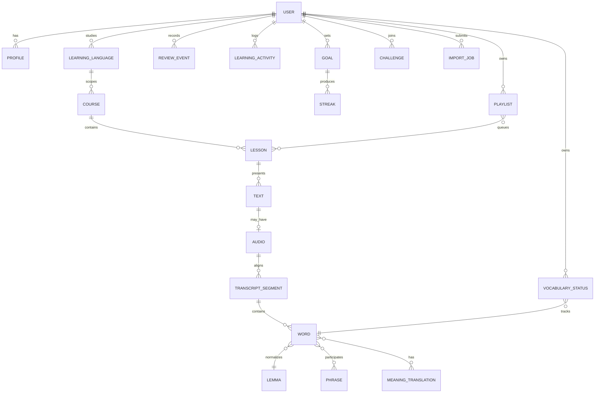

# Kavramsal ürün ve veri modeli

Bu diyagram gözlenen UI, model ve service ilişkilerinden çıkarılmış kavramsal modeldir; LinguaCafe’nin resmi backend şeması değildir.

Gelecekte POS/dependency, page/paragraph locator, audio provenance ve cache fingerprint bu modele eklenmelidir.

## Bizim ürünümüz için sonuç

Surface word, lemma, phrase ve sentence-role ayrı varlıklar olmalı; vocabulary stage tek başına “öğrenildi” anlamına gelmemeli. Source locator ve timestamp, aynı içeriğin yeniden kullanımını mümkün kılar.
