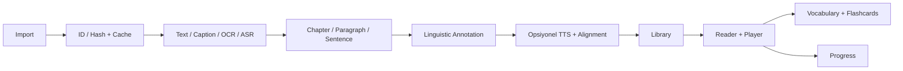
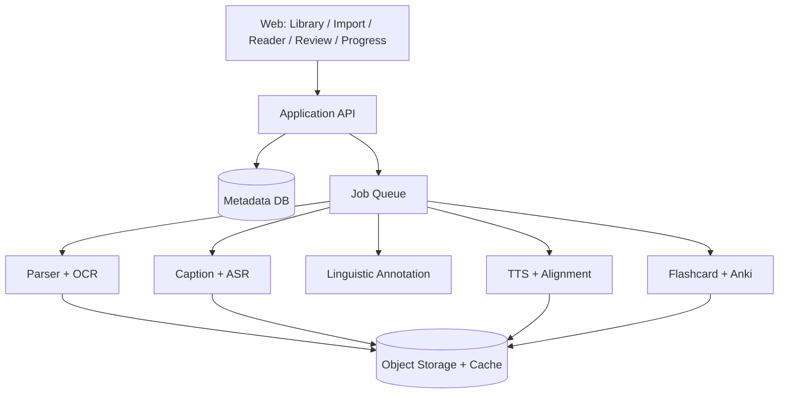

# Readify — Ürün One-pager

**Durum:** Ideacraft / product discovery · **İlk odak:** Fransızca, A2 sonu–B1 başlangıcı  
**Ayrıntılı özellik envanteri:** [FEATURES.md](FEATURES.md)

## Ürün tezi

Readify; kullanıcının seçtiği YouTube videosunu, EPUB/PDF/Markdown belgesini veya doğrudan yapıştırdığı düz metni, senkron ses, karaoke, cümle analizi, bağlamsal vocabulary, flashcard ve dürüst ilerleme takibi içeren interaktif bir dil öğrenme deneyimine dönüştürür.

`İçeriği seç → import et → oku ve dinle → kelimeyle etkileş → cümledeki görevini anla → bağlamda tekrar et → ilerlemeyi gör → devam et`

## Ana platform

- **Library:** Importlar, processing durumu, kaldığın yer ve uygun sonraki içerik.
- **Import Wizard:** Doğrudan metin yapıştırma, YouTube URL, EPUB, PDF ve Markdown.
- **Interactive Reader:** Page View, Sentence View, kelime/phrase ve grammar etkileşimi.
- **Player & Karaoke:** Original audio veya Qwen3-TTS; cümle/kelime senkronu, hız, seek ve loop.
- **Vocabulary & Review:** Learning/Known durumları, flashcards ve Anki export.
- **Progress:** Günlük hedef, streak, Learning Score, heatmap ve dil bazlı ayrıntılı istatistik.

## Import ve AI işleme

| Kaynak | Varsayılan yaklaşım |
| --- | --- |
| YouTube | Creator/manual caption → automatic caption → timing kontrolü → gerekirse align-only veya WhisperX |
| EPUB | Spine, chapter, heading ve paragraf sırasını koruyan extraction |
| PDF | Native text-first; yalnız taranmış/düşük kaliteli sayfalarda OCR; page anchor korunur |
| Yapıştırılan düz metin | Biçimlendirmeyi kaldırıp paragraf sırasını koruyan normalization |
| Markdown | Heading/liste/quote/paragraf yapısını koruyan normalization |

YouTube deneyimi audio-first kontroller ve video simgesiyle açılan embed olarak tasarlanır. Public URL'den caption/audio çıkarma, YouTube politikaları nedeniyle **deneysel ve launch öncesi hukuk/ToS incelemesi gerektiren** bir connector'dır. Güvenli fallback görünür embed + kullanıcının sağladığı `.srt`, `.vtt` veya transcript'tir; YouTube original audio'su ayrı medya olarak dışa aktarılmaz.

## TTS, sync ve maliyet

- YouTube/original audio varsa TTS çalışmaz. Text-only kaynaklarda 1–2 sabit Fransızca Qwen3-TTS sesi kullanılır.
- Metin `chapter → section → paragraph → sentence` olarak korunur; TTS kısa paragraf veya 1–3 cümlelik blok üretir.
- İlk bölüm hazırlanır; kullanıcı dinlerken sonraki iki paragraf prefetch edilir. Bütün kitap peşinen seslendirilmez.
- Qwen3-TTS sesi, Qwen3-ForcedAligner kelime zamanlarını üretir. Word alignment başarısızsa küçük blok retry, ardından sentence-level fallback kullanılır.
- Transcript metni iyi ama timing kötüyse yalnız alignment; transcript yok/kötüyse WhisperX çalışır.
- OCR yalnız gerekli PDF sayfalarında; bütün pahalı işler dedup/cache kontrolünden sonra yürütülür.
- Başlangıçta kendi GPU'muz kullanılır; provider/worker sınırları Docker ve ileride on-demand GPU'ya uyumlu olur.

## Reader ve kelime davranışı

**Page View**, chapter/page/paragraph yapısını koruyan sürekli okuma görünümüdür. Bütün kelimeler tıklanabilir, phrase seçilebilir ve aktif sentence/word audio ile vurgulanır.

**Sentence View**, tek cümlede önceki/sonraki gezinme, audio loop, translation, kelime anlamları, grammar-role etiketleri, head/parent bağlantıları, phrase grupları ve isteğe bağlı dependency tree sunar. `Review Sentence`, cloze veya kelime sıralama başlatabilir.

Görünüm tercihi lesson bazında saklanır; geçiş audio zamanını, seçili cümleyi veya vocabulary durumunu sıfırlamaz.

Kelime paneli: yüzey biçimi, lemma, anlam, source sentence, telaffuz, POS/morphology, cümle öğesi, parent word ve phrase group. Eylemler: `Öğreniyorum`, `Biliniyor`, `Kartlara ekle`, `Görmezden gel`, `Geri al`.

`Biliniyor`, varsayılan olarak **lemma ve bütün çekimlerine** uygulanır ve geri alınabilir. Lesson completion hiçbir kelimeyi otomatik Known yapmaz. Known kullanıcının öz-beyanıdır; farklı günlerde iki başarılı delayed review gerektiren `Recall Confirmed` ile karıştırılmaz. Known yapılan mevcut kart silinmez; review pause edilir ve `Tekrar çalış` ile açılır.

## Language intelligence

Fransızca ilk provider'ı Universal Dependencies tabanlı Stanza'dır: `tokenize, mwt, pos, lemma, depparse`. Surface token ile syntactic word ayrılır; lemma, POS, çekim, dependency, head/children ve parent phrase group saklanır.

Ham UD kodları özne, ana fiil/yüklem, doğrudan/dolaylı nesne, tümleç, niteleyici, zarf, belirleyici, yardımcı fiil ve edat gibi öğrenen dostu etiketlere çevrilir. İsteyen kullanıcı tam dependency tree'yi açabilir. Sonuçlar `Otomatik analiz` olarak işaretlenir.

## Flashcards ve Anki

Yalnız kullanıcının kaydettiği kelime/phrase kart olur; aynı lemma yeniden görüldüğünde duplicate yerine source occurrence eklenir. Core kartlar:

- Kelime/phrase → anlam
- Contextual cloze
- Audio → kelime

Anki export, medya içeren `.apkg` üretir. Özel note type; lemma, meaning, morphology, grammar role, head word, phrase group, source sentence, cloze, audio ve source locator taşır. Stable GUID kullanılır; scheduling geçmişi pakete konmaz.

## Progress ve motivasyon

LingQ benzeri sayfa; dil profili, günlük hedef, streak, heatmap, dönem filtreleri ve `Toplam + Dönem Değişimi` verir. Üç gerçeklik ayrılır:

- **Maruz kalma:** Aktif okuma/dinleme, token/unique lemma, audio coverage, section completion.
- **Kullanıcı beyanı:** Saved, learning ve self-marked Known.
- **Kanıtlanmış hatırlama:** Due review, accuracy, lapse, delayed recall ve Recall Confirmed.

Reader'ı yalnız açmak words read üretmez; 60 saniye idle sonrası timer durur. 2x hızda 5 dakika playback, 5 dakika listening ve 10 dakika audio coverage'tır. Reading ve listening aynı anda score'a iki kez yazılmaz.

| Learning Score | Puan |
| --- | ---: |
| 1 aktif okuma veya dinleme dakikası | 1 |
| Tamamlanan review | 0,25; günlük en çok 5 |
| Başarılı delayed recall | Ek 0,25; günlük en çok 5 |
| Save/Known/lesson açma/import | 0 |

Varsayılan günlük hedef 20'dir; 10/20/30/45/60 seçenekleri bulunur ve hedef tamamlanınca streak artar.

CEFR, resmî test değil güven seviyesi taşıyan bileşik tahmindir: lexical recall %40, delayed review %25, known coverage/assistance %20, input çeşitliliği %15. En az 3 çalışma günü, 3 section ve 50 review event olmadan `Veri toplanıyor` gösterilir.

## Veri, cache ve platform

- YouTube/public-lisanslı kaynaklar canonical source key ile global; yapıştırılan metin ve özel dosyalar içerik hash'i ile yalnız aynı hesap içinde dedup edilir.
- Shared `SourceAsset` ile kullanıcıya özel `LibraryItem`, vocabulary ve progress ayrıdır.
- NLP cache: sentence hash + language + parser version. TTS cache: text hash + voice + model/config version.
- GPU saniyesi, OCR sayfası, ASR/alignment dakikası, TTS karakter/audio dakikası ve cache-hit oranı izlenir.
- Importlar private-by-default olur.

## MVP sınırı

**Core:** Beş import türü, selective OCR, caption/ASR fallback, language annotation, Page/Sentence View, lemma-wide Known, senkron player/karaoke, kademeli TTS, vocabulary, üç flashcard türü, `.apkg`, Library ve dürüst progress.

**Sonra:** Voice cloning, tam çoklu dil, speaking/writing feedback, public library, community/tutor, badge/challenge/leaderboard ve cloud autoscaling.

## Teknik referanslar

[Qwen3-TTS](https://github.com/QwenLM/Qwen3-TTS) · [Qwen3-ForcedAligner](https://huggingface.co/Qwen/Qwen3-ForcedAligner-0.6B) · [WhisperX](https://github.com/m-bain/whisperX) · [UD French](https://universaldependencies.org/fr/) · [Stanza](https://stanfordnlp.github.io/stanza/depparse.html) · [Anki decks](https://docs.ankiweb.net/importing/packaged-decks.html) · [YouTube policies](https://developers.google.com/youtube/terms/developer-policies)
